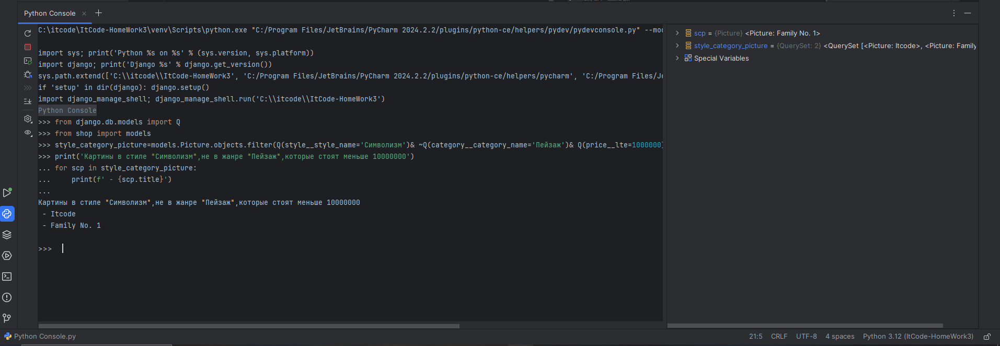
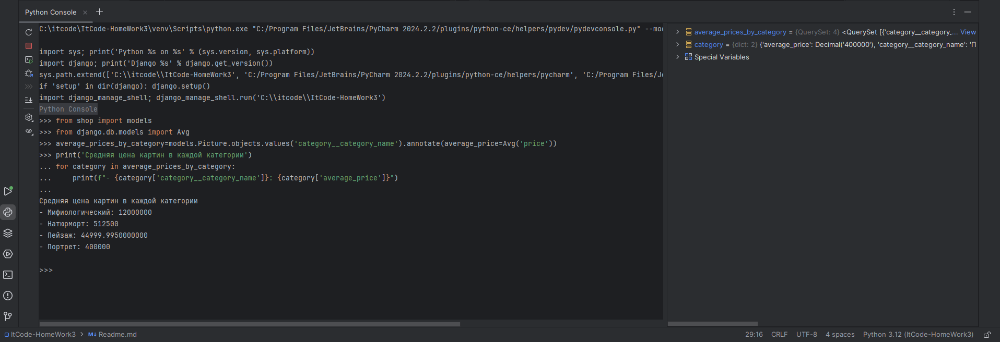

 ## Задание 1:
1.2:
1.3:
 ## Задание 2.1(filter):
2.2:
2.3:
## 2.4(exclude):
2.5
2.6
## 2.7(order_by)
2.8
2.9:
 ## 2.10(Сложный запрос):
 ## Задание 3.1(values):
3.2:
3.3:
## 3.4(values_list):
3.5:
3.6:
## Задание 4.1(оператор И):
4.2:
4.3:
## 4.4(оператор Или):
4.5:
4.6:
## 4.7(исключение+фильтрация)
4.8:
4.9:
## Задание 5.1(annotate):
5.2: 
5.3: 
## 5.4(aggregate): 
5.5: 
5.6:
# Домашнее задание №6:
## Фильтры: 
## Добавление фильтра(кнопки и полей) в шаблон list: 
# Проверка:
## 1.(По названию картины)
## 2.(По автору)
## 2.2 
## 3.(По жанру) 
## 3.2
## 4.(По стилю) 
## 4.2 
## 5.(По ценовому диапозону) 
## 6.(По наличию в магазине)
## 6.2(Продано) 
## 6.3
## 6.4(В наличии)
## 7.(По оригинальности картины)
## 7.2(Оригинал)
## 7.3
## 7.4(Копия)
## 8.(По годовому диапозону)
## 9.(По критериям автора|картины|описания)
## 9.2 
# 10.'Оригинальный критерий'(фильтр по поиску картин с определенным стилем и определенным жанром)
## 10.2
## 10.3 
## 11.(Через фильтр ищем конкретную картину)
## 11.2
## 11.3(И второй раз)
## 11.4
